# Crypto tracker app 

### About
This is an app for monitoring cryptocurrency exchanges and saving your cryptocurrencies to your coins portfolio.
It uses SwiftUI and is written 100% Swift. The project benefits from multi-threading, publishers/subscribers, and date persistanse.

## Includes ( ALL SWIFTUI )
- MVVM architecture
- Combine Framework
- Core Data
- Rest API (coingekto.com)
- Custom Modifiers
- Animations
- Light and Dark Mode
- Devices: iphone, ipad

## Video

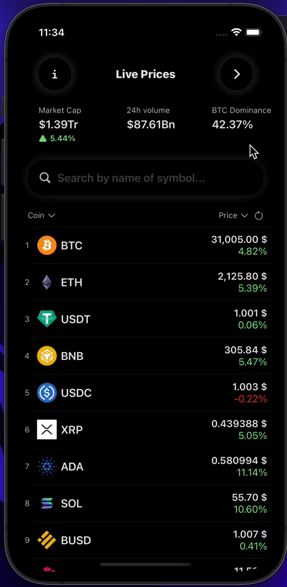

## Screenshots 📷

### Light theme

  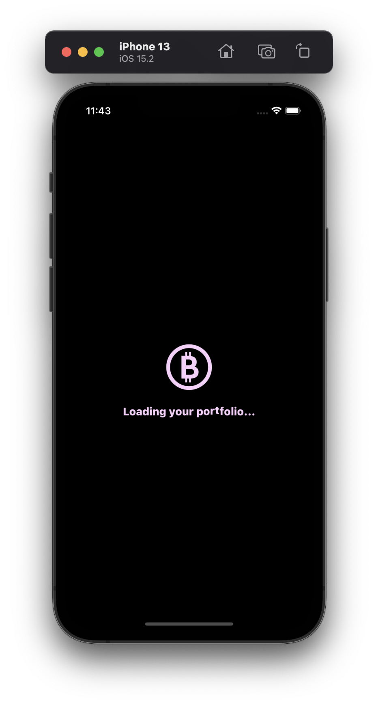
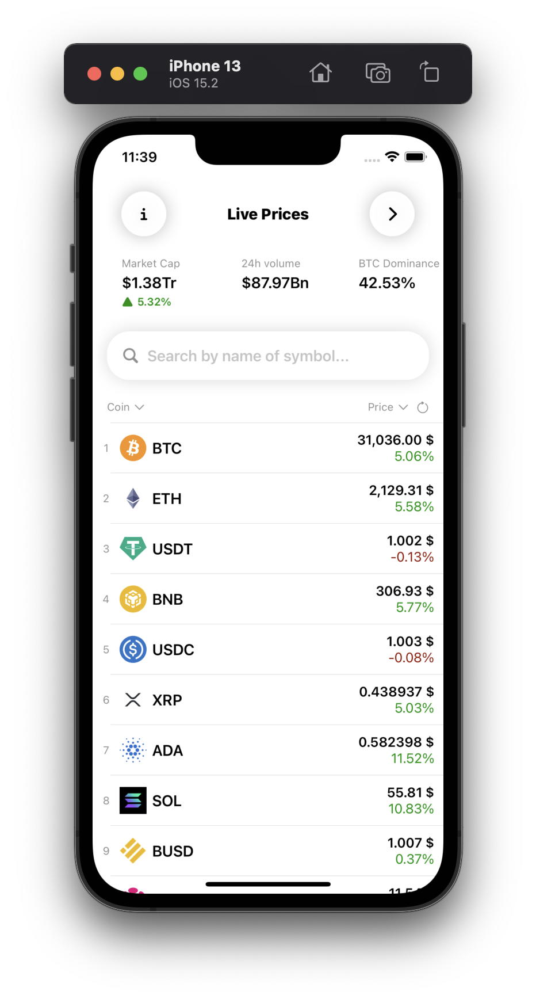
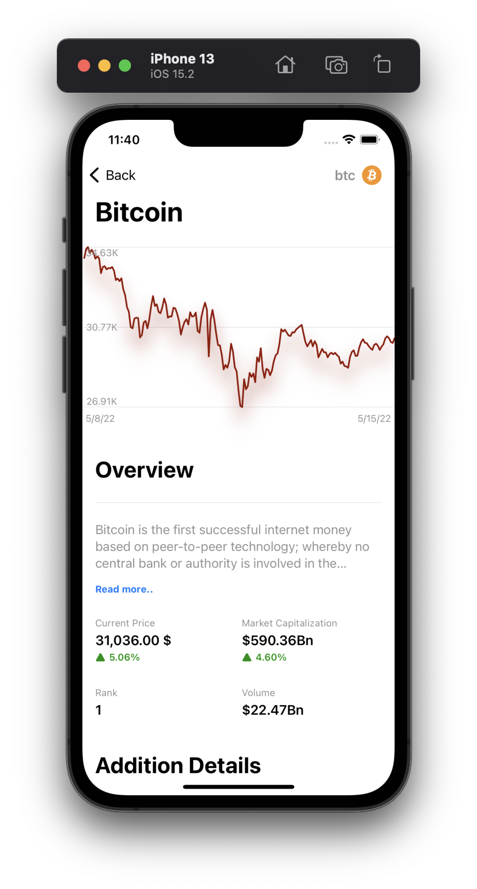
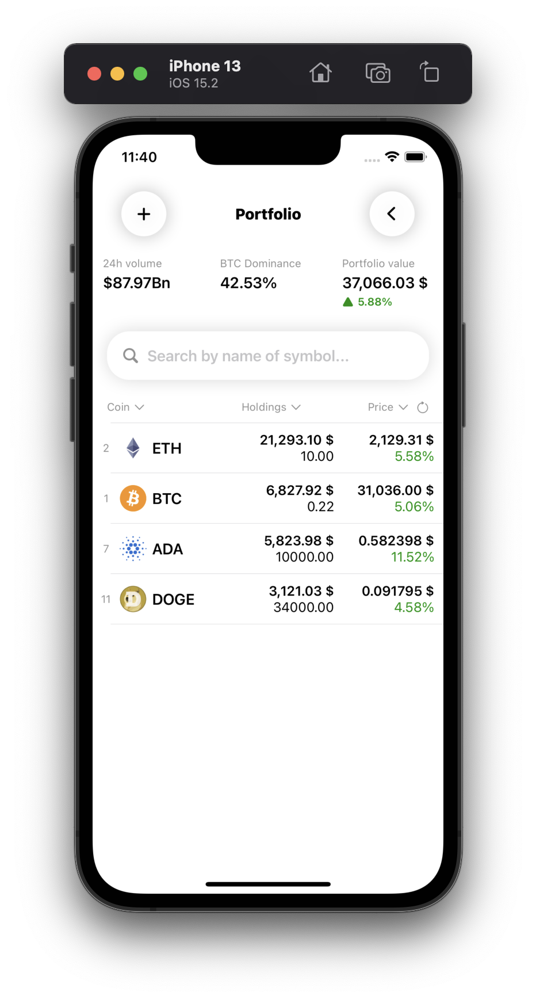
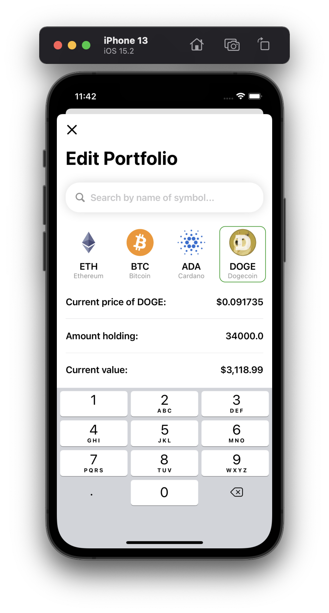

### Dark theme

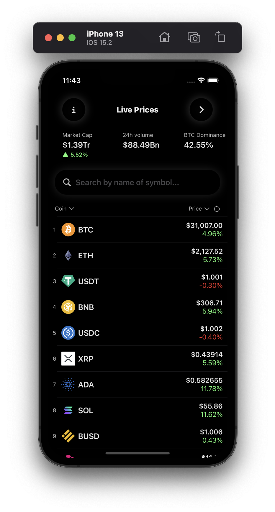
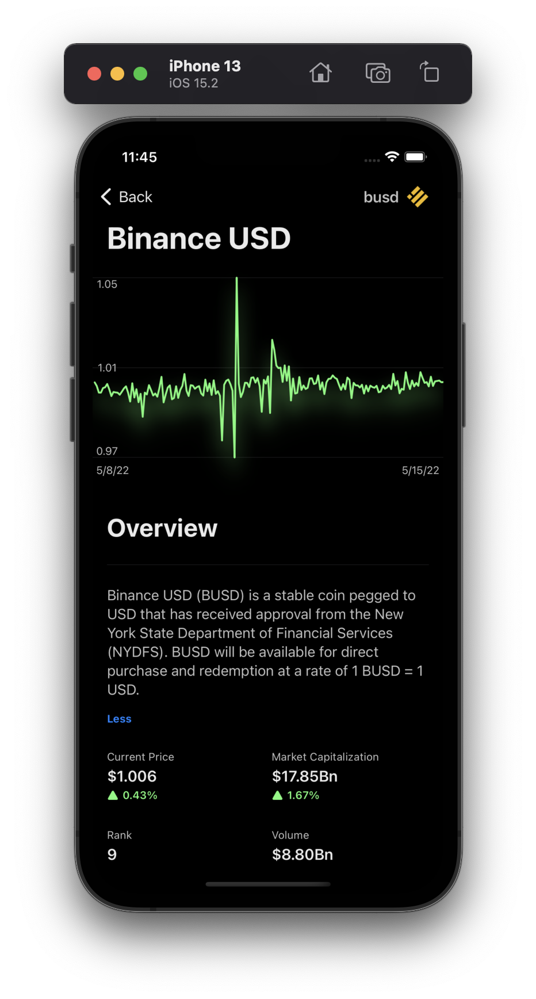
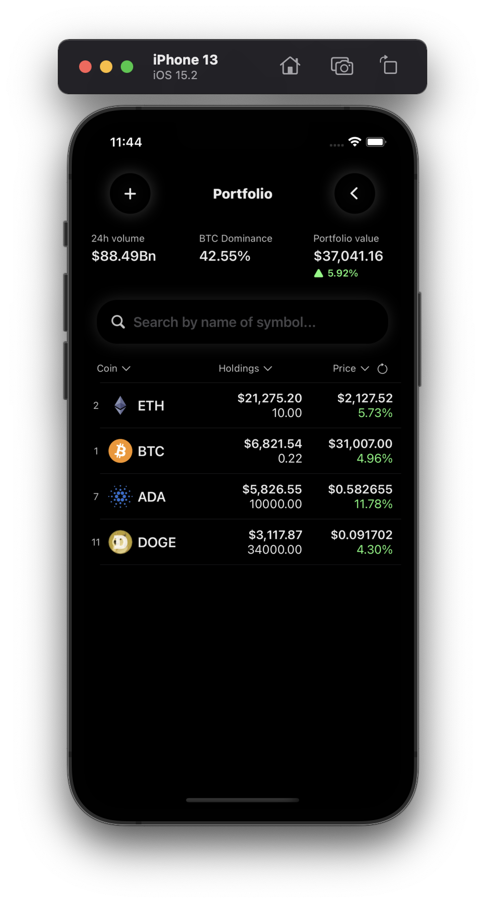
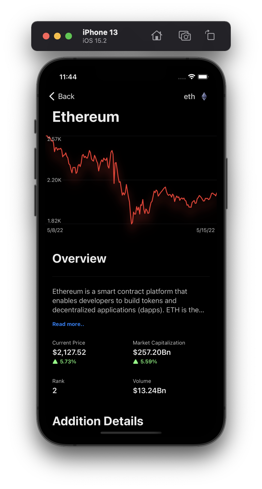
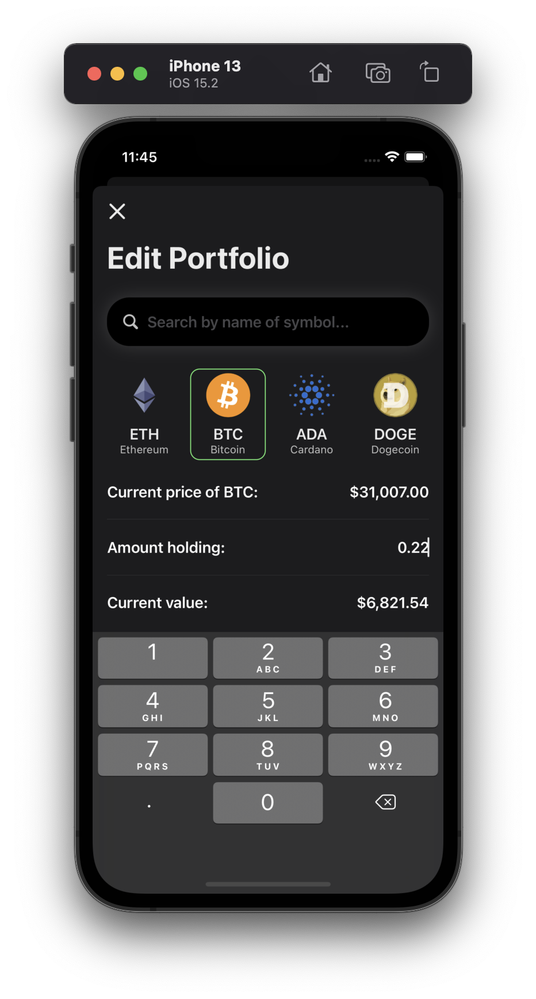
  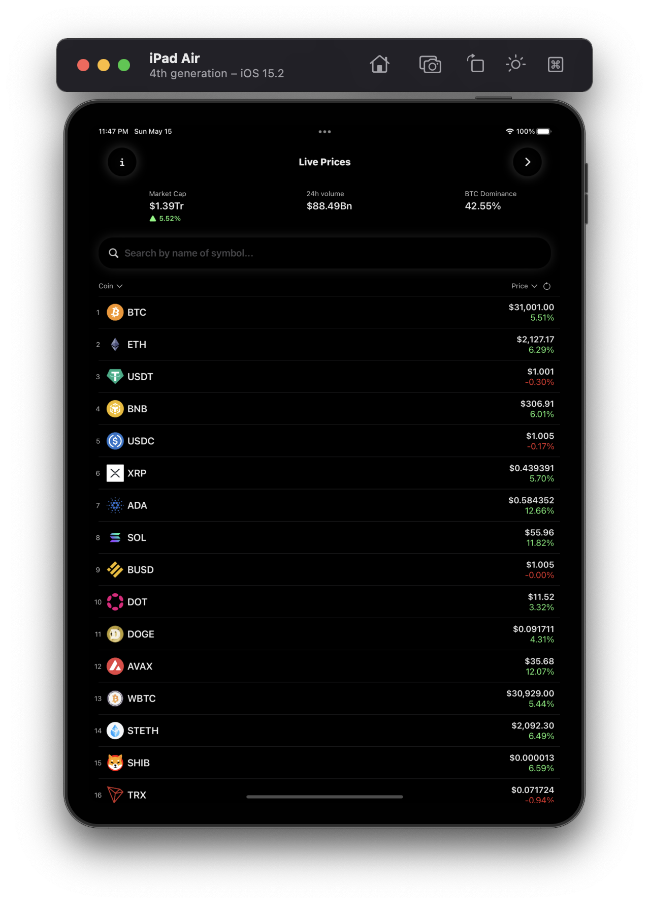
  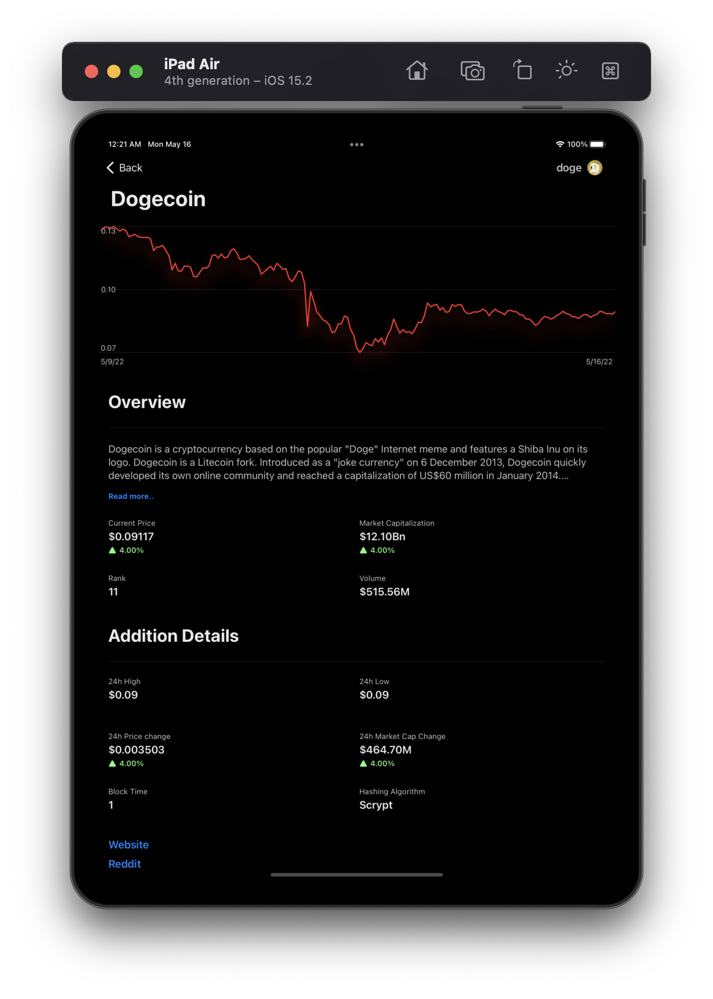
 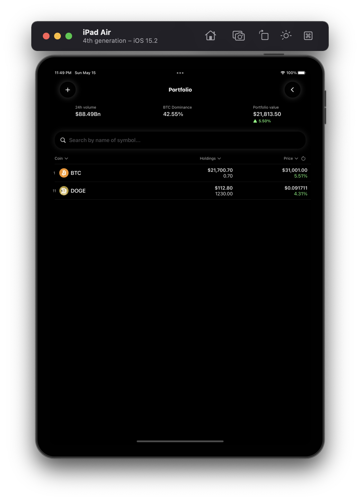

